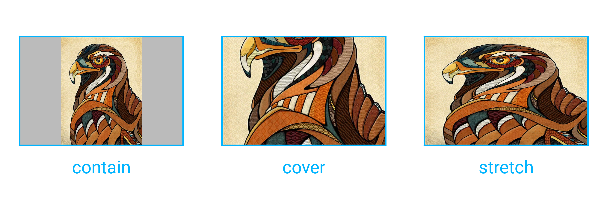

## Overview

`<image>` is used to render a specified picture, and it shouldn't contain any child component. `` is not supported currently.

### Basic Usage

> **Notes:** the styles of `width` and `height` should be specified, otherwise it won't work.

```html
<image style="width:500px;height:500px" src="https://vuejs.org/images/logo.png"></image>
```

See the [real result](http://dotwe.org/vue/00f4b68b3a86360df1f38728fd0b4a1f).

## Attributes

| Attribute | Type | Value | Default Value |
| - | - | - | - |
| `placeholder` | String | {URL &#124; Base64} | - |
| `resize` | String | conver &#124; contain &#124; stretch | stretch |
| `src` | String | {URL &#124; Base64 } | - |

### `placeholder`

### `resize`



+ `contain`: balala. ([Example](http://dotwe.org/vue/89be94dcd1fec73b77246ec46c678914))
+ `cover`: balala. ([Example](http://dotwe.org/vue/f38e311d2e6b2af87f0a65a8f37d9490))
+ `stretch`: [default] balala. ([Example](http://dotwe.org/vue/f38e311d2e6b2af87f0a65a8f37d9490))

CSS [`background-size`](https://developer.mozilla.org/en-US/docs/Web/CSS/background-size).

### `src`

> **Notes:**: src path

#### Supported image formats

Depends on your image libs.

## Styles

`<image>` is block level.

## Events

Support **[common events](../../wiki/common-events.html)**: `click`, `longpress`, `touchstart`...

### `load`

## Component Method

> What's component method?

### `save`

## Usage Notes

+ No children

## Examples

+ [Base64 image](http://dotwe.org/vue/4624d605004fc7eb9f14ca9c5a226fe3)
+ [Multi-layer images](http://dotwe.org/vue/4624d605004fc7eb9f14ca9c5a226fe3)
+ [Lazy load image](http://dotwe.org/vue/4624d605004fc7eb9f14ca9c5a226fe3)
